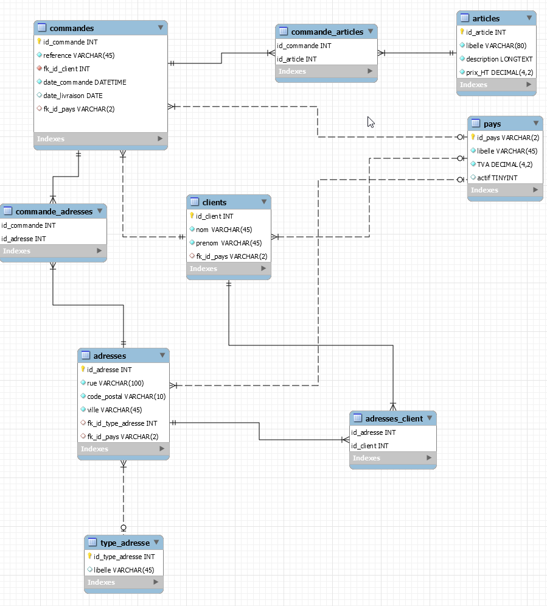

# Evaluation formation JPA avec Spring DATA

## Préambule
L'évaluation porte sur le même projet que pour le TP avec le même modèle de données.
Le projet est configuré pour fonctionner avec une base de données en mémoire H2.

L'évaluation portera dans un premier temps sur le fait que votre code fonctionne. Puis sur la qualité des solutions mises en œuvre.

Au cours de la formation nous avons vu que spring data JPA offrait de nombreuses solutions pour interagir avec une base de données (JPQL, méthode auto générée, requête par nom de méthode, requête native).

Par conséquent, vous êtes libres de mettre en place la solution que vous souhaitez pour répondre aux attentes fonctionnelles décrites.

La livraison de votre travail devra ête réalisée le vendredi 18 novembre au plus tard.
La livraison doit avoir lieu de préférence sur la boite à livrable sur moncampus (si elle est disponible d'ici là) ou par email sur l'une des adresses suivantes. :
 - david.derigent@ext.groupe-igslyon.com (mail IPI)
 - david.d@explo-it.coop (mail pro)

## Initialisation du projet Java
- Créer un projet Maven à partir du contenu du répertoire tp-jpa-spring-data

## Créer les entités manquantes :
- Créer les entités correspondant aux tables suivantes :
    - type adresse
    - adresses (avec les objets correspondants aux tables "type_adresse" et "pays")

## Pour les entités correspondant aux tables "type_adresse" et adresses
- Créer les DAO

- Vérifier le bon fonctionnement de leur méthode de sauvegarde pour vérifier que le mapping est correcte.

## Enrichir l'entité correspondant à la table "clients"
- Un client est associé à une ou plusieurs adresses
Faites apparaitre cette relation dans l'entité gérant les clients.

- Vérifier le bon fonctionnement avec la méthode de sauvegarde (elle doit alimenter la table "adresses_client"), puis le bon fonctionnement de la lecture, elle doit ramener les adresses associées à un client, quand on lit les données d'un client.

## Enrichir l'entité correspondant à la table "commandes"
- Une commande est associée à une ou plusieurs adresses
  Faites apparaitre cette relation dans l'entité gérant les commandes.

- Quand le service d'expédition traite une commande, il souhaite récupérer les articles, les informations du client, mais ne souhaite récupérer que l'adresse de livraison. le but est d'éviter des erreurs de saisie lors de la préparation de la commande. Réfléchissez à la manière de mettre en œuvre cela puis réaliser les modifications nécessaires.

## Enrichir le DAO correspondant aux commandes

- Le service d'expédition doit pouvoir modifier la date de livraison d'une commande.
    - Créer une méthode permettant de modifier une commande existante, elle a en entrée une référence de commande et une date de livraison
- Le service commercial réalise parfois des recherches particulières implémentez les méthodes nécessaires :
    - Rechercher tous les clients ayant réalisé une commande à une date supérieure à la date reçue en paramètre et trier par date croissante
    - Rechercher les commandes ayant toutes les caractéristiques suivantes :
        - Effectuées à partir d'un pays donné
        - Effectuées sur une année donnée (C'est la finalité à vous de voir comment le retranscrire d'un point de vue technique)
        - Effectuées par un client dont le nom ou le prénom corresponde à la chaine de caractère saisie

